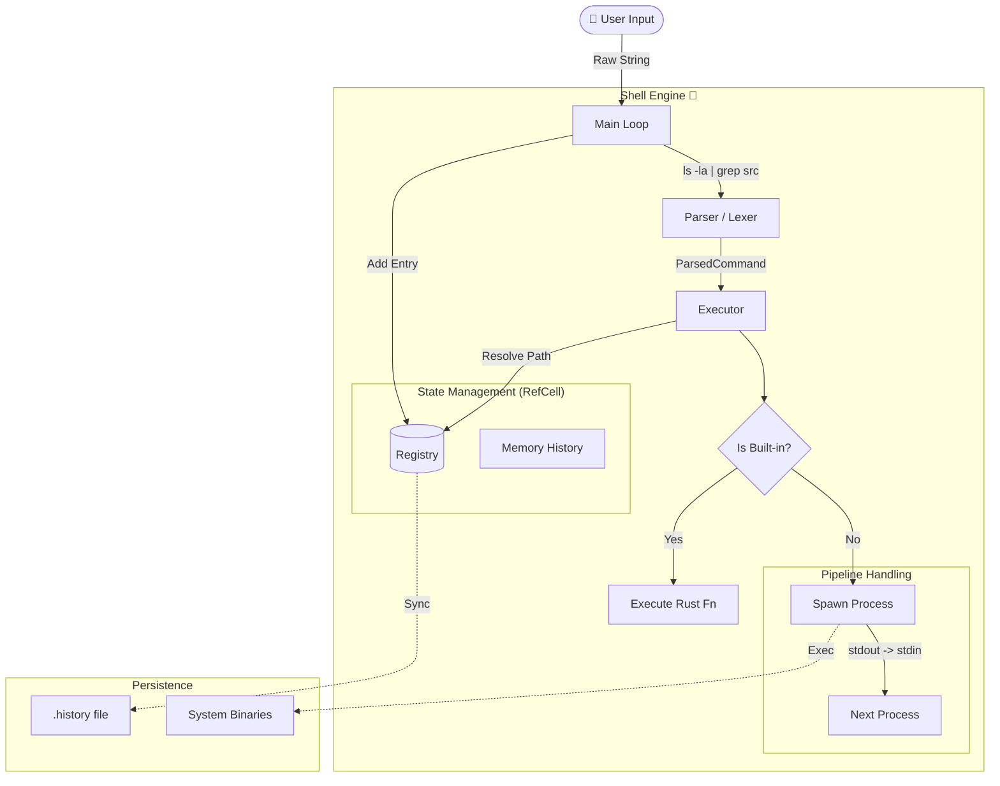

# POSIX-compliant Shell in Rust 🦀


A robust, fully functional shell implementation built from scratch in Rust. This project was developed as part of the [CodeCrafters](https://codecrafters.io) "Build your own Shell" challenge, with a focus on deep systems programming concepts, manual process orchestration, and POSIX compliance.

## ✨ Features

Unlike basic shell wrappers, this implementation handles low-level process management and I/O streams manually.

### 🚀 Core Execution Engine
* **External Commands:** Executes any binary present in `PATH` or via absolute/relative paths.
* **Built-in Commands:** Custom implementation of `cd`, `pwd`, `echo`, `type`, `exit`, and `history`.
* **Command Registry:** A decoupled architecture where commands are resolved dynamically (preferring built-ins over executables).

### 🔗 Pipelines & I/O
* **Multi-stage Pipelines:** Supports chaining commands (`cat | grep | wc`) by manually managing file descriptors and connecting `stdout` to `stdin` across processes.
* **Redirection:** Full support for:
    * `>` (Truncate/Write stdout)
    * `>>` (Append stdout)
    * `2>` (Redirect stderr)
    * `2>>` (Append stderr)

### 📜 Persistent History Management
A custom history engine that mirrors `bash` behavior without relying on default library implementations for persistence:
* **In-memory & File Sync:** Commands are stored in memory and synced to a `.history` file.
* **Manual Flags:** Implemented `history` flags manually:
    * `-w`: Write current session history to file.
    * `-r`: Read history from file to memory.
    * `-a`: Append only new session lines to the file (avoiding full rewrites).
* **Navigation:** Arrow key navigation (Up/Down) integrated via `rustyline`.

### 🧠 Advanced Parsing
* **Quoting:** Handles single (`'`) and double (`"`) quotes, preserving spaces within arguments.
* **Escaping:** Supports backslash escapes (e.g., `\n`, `\\`, `\"`).

## 🛠️ Architecture

The project follows a modular architecture to ensure separation of concerns:

1.  **Parser:** Lexes the raw input string, handling quoting rules and breaking it into a structured `ParsedCommand`.
2.  **Registry:** Acts as the "Brain". It holds the state of the shell (history, known executables) using `RefCell` for interior mutability, allowing the state to be shared safely across the application.
3.  **Executor:** The "Muscle". It decides whether to run a Rust function (for built-ins) or spawn a system process (`std::process::Command`). It handles the complex logic of pipe bridging and I/O redirection.

## 🏗️ Architecture Diagram




## 📦 Installation & Usage

Ensure you have Rust and Cargo installed.

```bash
# Clone the repository
git clone [https://github.com/YOUR_USERNAME/your-shell-repo.git](https://github.com/YOUR_USERNAME/your-shell-repo.git)

# Navigate to the directory
cd your-shell-repo

# Run the shell
cargo run --release
```

## Examples
Once inside the shell, you can run:
```
# Basic commands
$ echo "Hello Rust"
Hello Rust

# Pipelines
$ ls -la | grep "src" | wc -l
4

# Redirection
$ echo "Log entry" >> app.log
$ cat app.log
Log entry

# History manipulation
$ history -a
$ history
    1  echo "Hello Rust"
    2  ls -la | grep "src" | wc -l
    3  echo "Log entry" >> app.log
    4  history -a
    5  history
```

## 🤝 Acknowledgements
This project was guided and tested via [CodeCrafters](https://app.codecrafters.io). Be sure to check them out!
